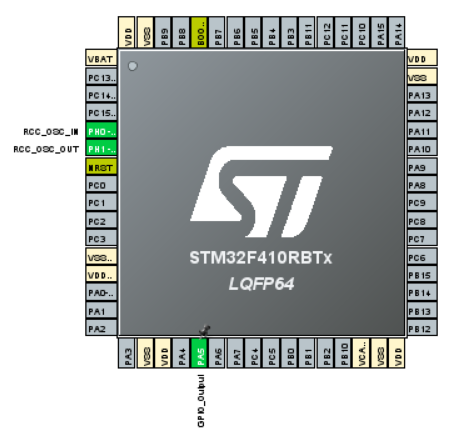

### Rapport 1ère séance : 08-10-2021

Le but de cette séance était de prendre en main la STM32 Nucleo. Pour ma part, il s'agit plus précisément d'une STM32F410RBT6. Pour commencer, j'ai donc téléchargé STM32CubeMX sur le site de ST, qui est le logiciel permettant de configurer la carte. Mais pour pouvoir la programmer, il faut aussi télécharger Keil $\alpha$ Vision

