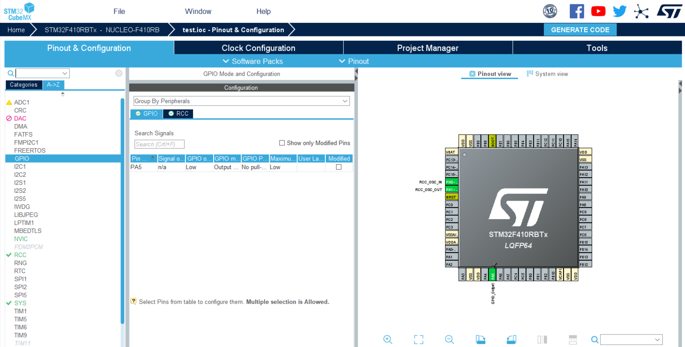
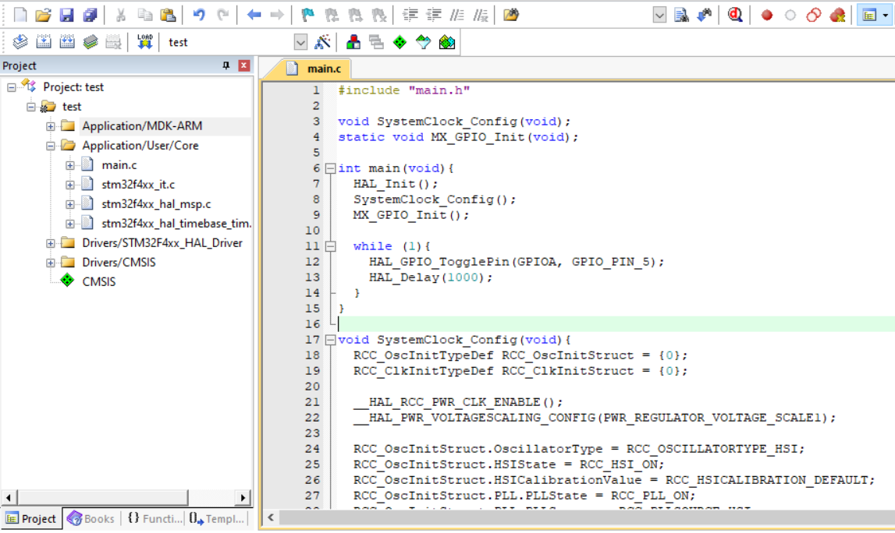

### Rapport 1ère séance : 08-10-2021

Le but de cette séance était de prendre en main la STM32 Nucleo. Pour ma part, il s'agit plus précisément d'une STM32F410RBT6. Pour commencer, j'ai donc téléchargé STM32CubeMX sur le site de ST, qui est le logiciel permettant de configurer la carte (https://www.st.com/content/st_com/en/products/development-tools/software-development-tools/stm32-software-development-tools/stm32-configurators-and-code-generators/stm32cubemx.html). Mais pour pouvoir la programmer, il faut aussi télécharger Keil uVision. Je l'ai donc récupéré sur le site de M. BILAVARN, car on l'avait utilisé l'année dernière (http://users.polytech.unice.fr/~bilavarn/elec3_micropro.html).

Enfin, il a été nécessaire de télécharger le driver de la carte. Celui-ci est dispo sur le site de ST (https://www.st.com/en/development-tools/stsw-link009.html).

Ensuite, j'ai suivi un tuto trouvé sur YouTube (https://www.youtube.com/watch?v=BJdXR0Al6os) qui permet de faire clignoter une LED avec ce type de carte. Voici l'interface de STM32cubeMX après avoir créé un projet :

Ensuite, une fois la configuration terminée, on peut générer le code et cela lance uVision :

